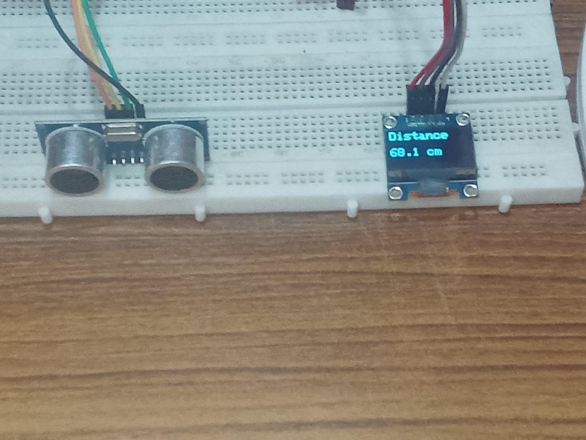
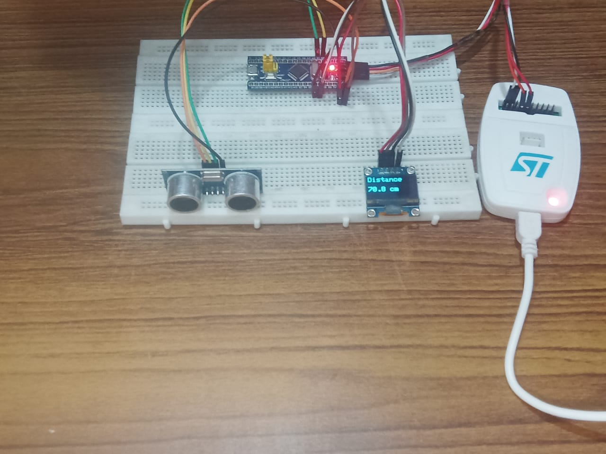
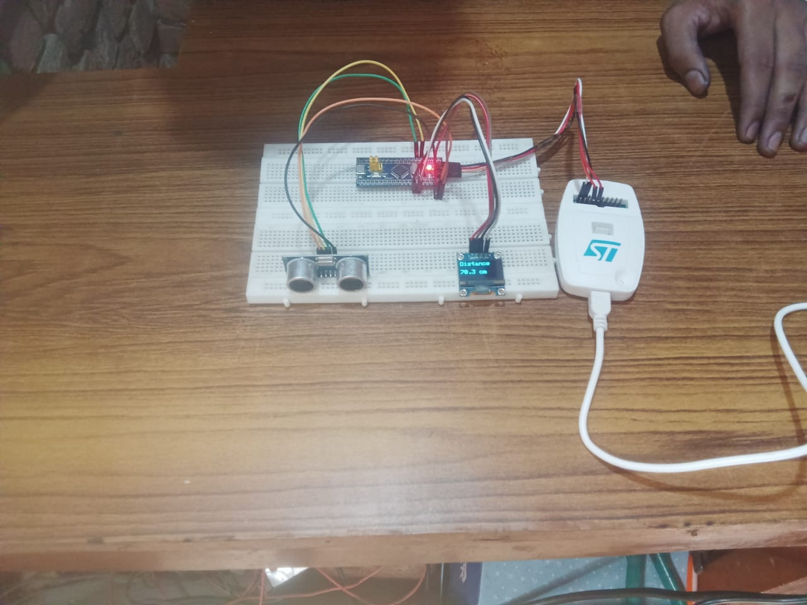

<div align="center">

#  STM32 Distance measurment system

### Professional Embedded Systems Project using **STM32F103C8T6 (Blue Pill)** & **ST-Link V2**

Build • Flash • Debug • Learn

<p>


</p>

**A complete beginner-friendly STM32 project demonstrating professional firmware development workflow using STM32CubeIDE and ST-Link V2.**

</div>

## 🎥 Watch Full Tutorial on YouTube

<p align="center">
  <a href="https://youtu.be/qKnp0oNrI6M">
    
  </a>
</p>

<p align="center">
  <b>📺 Click the thumbnail above to watch the complete tutorial.</b>
</p>

---

# 📖 Overview

This repository demonstrates the complete firmware development workflow for the **STM32F103C8T6 Blue Pill** microcontroller.

The objective of this project is not only to upload a program into the microcontroller, but also to understand the engineering workflow followed in real embedded systems development.

This repository is structured like professional open-source projects so that students, beginners, and recruiters can easily understand the implementation.

---

# 🎬 Video Tutorial

> Click the thumbnail below to watch the complete tutorial.

[](https://youtu.be/YOUR_VIDEO_ID)

---

# 🖼 Project Preview

project images.

<p align="center">
  
</p>

<p align="center">
  
</p>

<p align="center">
  
</p>


---

# ✨ Key Features

- Professional STM32 project structure
- Beginner-friendly explanation
- Complete STM32CubeIDE project
- ST-Link V2 programming
- Clean and well-commented Embedded C code
- Easy hardware setup
- Debug-ready project
- GitHub portfolio ready
- Industry-style documentation
- Open-source and easy to understand

---

# 🎯 What You'll Learn

- STM32 Architecture
- Blue Pill Development Board
- ST-Link V2 Programming
- STM32CubeIDE Workflow
- Firmware Development
- Firmware Flashing
- Hardware Debugging
- Embedded C Programming
- Professional Project Organization
- Git & GitHub Documentation

---

# 🛠 Hardware Used

| Component | Description |
|-----------|-------------|
| STM32F103C8T6 | Blue Pill Development Board |
| ST-Link V2 | Programmer / Debugger |
| Breadboard | Prototype Connections |
| Jumper Wires | Hardware Connections |
| USB Cable | Power & Programming |

---

# 💻 Software Used

| Software | Purpose |
|----------|---------|
| STM32CubeIDE | Development Environment |
| STM32CubeMX | Peripheral Configuration |
| ST-Link Driver | Programming Support |
| Git | Version Control |
| GitHub | Repository Hosting |

---


# 📚 Documentation

| Document | Description |
|-----------|-------------|
| 📦 Hardware | Components used in the project |
| 🔌 Connections | Wiring and pin mapping |
| ⚙ Workflow | Development process |
| ✨ Features | Project capabilities |
| 📘 Code Explanation | Source code walkthrough |
| 🎓 Learning Outcome | Skills gained after completing the project |

---

# 🚀 Quick Start

### Clone Repository

```bash
git clone https://github.com/YOUR_USERNAME/STM32-Programming-Blue-Pill.git
```

### Open Project

- Launch STM32CubeIDE
- Import Existing Project
- Build Project
- Connect ST-Link V2
- Flash Firmware
- Verify Output

---

# 🧠 Skills Demonstrated

This project demonstrates practical experience in:

- Embedded Systems
- Embedded C Programming
- Firmware Development
- ARM Cortex-M3
- STM32CubeIDE
- Hardware Debugging
- GPIO Programming
- Git Version Control
- GitHub Documentation
- Technical Writing

---

# 📈 Future Roadmap

- [x] STM32 Setup
- [x] ST-Link Programming
- [x] CubeIDE Project
- [ ] GPIO Projects
- [ ] UART Communication
- [ ] PWM Generation
- [ ] ADC Reading
- [ ] Timers
- [ ] Interrupts
- [ ] SPI
- [ ] I2C
- [ ] OLED Display
- [ ] FreeRTOS
- [ ] USB Communication
- [ ] CAN Bus

---

# 💼 Why This Project Matters

This repository showcases practical embedded engineering skills beyond writing code.

It demonstrates:

- Professional documentation
- Project organization
- Firmware development workflow
- Hardware interfacing
- Debugging techniques
- Industry-standard development tools

This makes the project suitable for engineering portfolios, internships, and campus placement interviews.

---

# 👨‍💻 About the Author

## Manish Pal

**B.Tech Student | Embedded Systems Enthusiast**

Passionate about building real-world embedded systems using STM32, ESP32, Raspberry Pi Pico, and Linux.

Current Focus:

- Embedded Systems
- Firmware Development
- IoT
- Robotics
- Open Source
- Linux
- GitHub Projects

---

# 🤝 Contributing

Contributions, suggestions, and improvements are always welcome.

If you find an issue, feel free to open an Issue or submit a Pull Request.

---

# 📄 License

This project is licensed under the MIT License.

---

<div align="center">

## ⭐ If this repository helped you, consider giving it a Star.

It motivates me to create more open-source embedded systems projects.

**Happy Learning! 🚀**

</div>